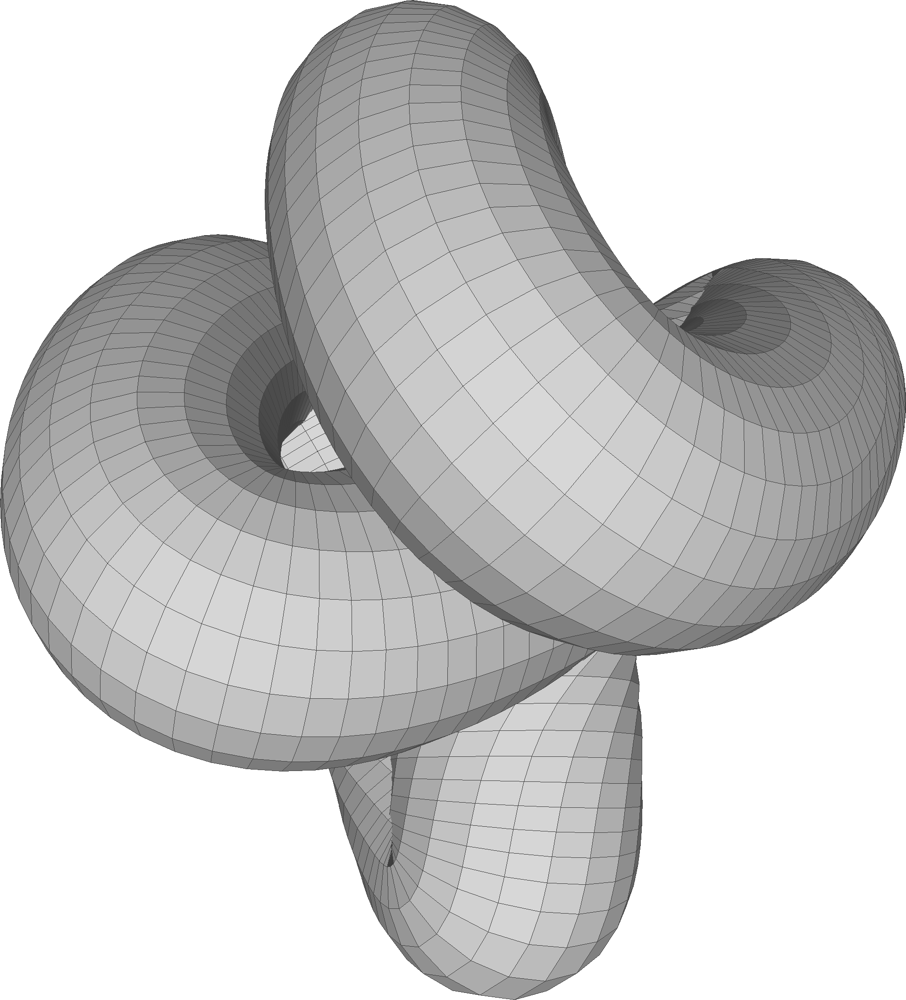

# knot-engine
Generates a Wavefront .OBJ file for a 3D Lissajous knot.
Just run `python3 ./knot-engine.py` and see what happens, or
`python3 ./knot-engine.py --help` for more options.

I find it nice to view them in [MeshLab](https://www.meshlab.net/).
Here's the default output:

You can make it look janky by setting a low `--curve-density`.
This one is done with `--curve-density 30`:

The parametric formulae that specify the curve contain three coefficients, given in
`-a`, `-b`, and `c`. This curve was generated with ``-a 1 -b 2 -c 3``:

Here's the same curve with ``--wrap-radius 50``:

